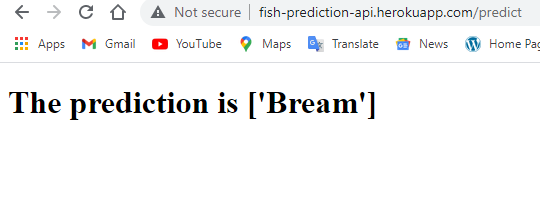

# Project Title 
Predict the fish species via REST API based on the fish market sales dataset
# Problem Statement 
There are seven fish species in the fish market dataset, and the dataset was recorded in terms of biometric sizes. Seven researchers in the Kaggle website worked on the fish market dataset with different approaches. Unfortunately, the researchers did not find the best model in terms of accuracy for the dataset. The aim of this project is finding the best model with the highest accuracy and embeded the model in a web based application for educational purposes.
# Approach 
In this project, K-Nearest Neighbor, Support Vector Machine and Random Forest algorithms were applied on the fish market dataset. The accuracy of each model is calculated by five accuracy methods ( Train-Test-Split, K Fold Cross Validation, Stratified K-Fold Cross Validation, Leave one out Cross Validation ( LOOCV ), Repeated Random Test-Train-Split ). Ultimately, the Support Vector Machine had the best result.
# Results 
There are three main components ( application, model, templates ) in the application package. The application was developed by the Flask framework. The Support Vector Machine model connected to the application by pickle link. The templates were designed by HTML and CSS. Therefore, the application is able to predict fish species with 97% accuracy through the REST API on the Heroku cloud platform.
# Dataset Link
https://www.kaggle.com/aungpyaeap/fish-market

https://www.kaggle.com/aungpyaeap/fish-market/discussion/97243

Species : Perch, Bream, Roach, Pike, Smelt, Parkki, Whitefish
Weight = Weight ( gr )
Length 1 = Vertical _ length ( cm )
Length 2 = Horizental_length or Length ( cm )
Length 3 = Diagonal _length ( cm )
Height = Vertical_length ( cm ) without fins 
Width = Width ( cm ) without gills 

#  Three Pipelines
https://github.com/borhanfar/species-project-pipeline1/blob/main/Apply_three_models_on_dataset.ipynb

https://github.com/borhanfar/species-project-pipeline2/blob/main/Modifying_dataset_with_StandardScaler_then_apply_three_models.ipynb

https://github.com/borhanfar/species-project-pipeline3/blob/main/Modifying_dataset_with_StandardScaler_and_drop_outliers_then_apply_three_models.ipynb

# Software Solution
## Develop an application in the local machine.
1) Create a virtual environment in the local machine.
2) Developing the python app by Flask.
3) Developing the model and connecting the model to the main app.
4) Developing web templates by HTML and CSS 
## Transfer application to GitHub
GitHub ( use a GitHub link )
## Deploy application in the Heroku cloud application platform.
Create a new app on the Heroku platform and Deploy application repository through the Github connection section.
# Application
http://fish-prediction-api.herokuapp.com
# Software testing

As can be seen, there are new parameters in the application’s home page. The names of six columns in the dataset have changed to the new names. Because, it helps the better understanding for those people who do not know about dataset and they would like to use the application for their own aims. They are shown below.

Weight ( gr ) = Weight 

Vertical _ length ( cm ) = Length 1 

Length ( cm ) = Length 2

Diagonal _length ( cm ) = Length 3

Height ( Vertical_length without fins) ( cm ) = Height 

Width ( without gills) ( cm ) = Width 
 
This is the time to interact and fill the gap in the application. For example, It has chosen the first row from the dataset.

Weight ( gr ) = Weight = 242.0

Vertical _ length ( cm ) = Length 1 = 23.2

Length ( cm ) = Length 2 = 25.4

Diagonal _length ( cm ) = Length 3 = 30.0

Height ( Vertical_length without fins) ( cm ) = Height =11.52

Width ( without gills) ( cm ) = Width = 4.0200

When the user chooses the prediction button or press enter key on keyboard, the application starts to predict the species. There is a connection among model.py, main.py and index.html. The data collected through index.html. They are processed in model.py and main.py, then main.py shows the species through result.html. The image below shows how the application displays the prediction through result.html.

